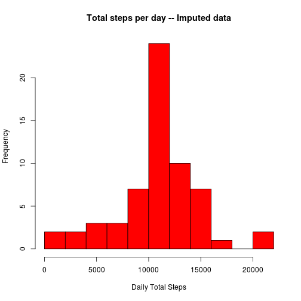
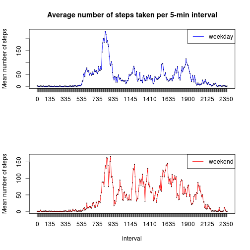

# Reproducible Research: Peer Assessment 1


## Loading and preprocessing the data

The code below checks if the data file exists in the current folder. If not, the script downloads the raw data from internet. If the data is already available in the working directory, the downloading step will be skipped. The code will then unzip the downloaded data (in .zip format) and load the data into memory.

The date variable will then be converted in the Date format and the interval variable will be treated as factor (so it can be used as a grouping variable).

Nothing will be outputed from this section of code. 

Please make sure you are online if you don't have the data in place, or the code might fail downloading the required data. This part of code is tested only under Linux. You might need to modify the *method* parameter for the download.file() function to suit your system.


```r

dataURL <- "https://d396qusza40orc.cloudfront.net/repdata%2Fdata%2Factivity.zip"

### Download data
if (file.exists("./activity.zip") || file.exists("./activity.csv")) {
    message("== Data file (zip or csv format) exists, skipping downloading step \r")
    
} else {
    
    message("== Downloading data file...\r")
    download.file(url = dataURL, destfile = "./activity.zip", method = "wget")
    
}
```

```
## == Data file (zip or csv format) exists, skipping downloading step 
```

```r

### Extract data
if (file.exists("./activity.csv")) {
    message("== Data file (csv format) exists, skipping extraction...\r")
} else {
    message("== Extracting data ... \r")
    unzip(zipfile = "./activity.zip", exdir = "./", )
}
```

```
## == Data file (csv format) exists, skipping extraction...
```

```r


### Load data
data <- read.csv("./activity.csv")

data$date <- as.Date(data$date, format = "%Y-%m-%d")
data$interval <- as.factor(data$interval)
```


## What is mean total number of steps taken per day?

In this section, the raw data will be aggreated by date. For each day, the total number of steps taken are calculated. The mean and standard deviation of number of steps taken per 5-minute interval are also calculated for each day, but these variables are not used in the later analysis.

A histogram is then generated showing the distrubution of the total number of steps taken each day (see Fig. 1). The mean and median total number of steps taken per day are also calculated and reported.


```r

library("plyr")
dfPerDate <- ddply(data, ~date, summarise, sumSteps = sum(steps, na.rm = TRUE), 
    meanSteps = mean(steps, na.rm = TRUE), sdSteps = sd(steps, na.rm = TRUE))

meanTotalStepsPerDay <- mean(dfPerDate$sumSteps, na.rm = TRUE)
medianTotalStepsPerDay <- median(dfPerDate$sumSteps, na.rm = TRUE)

hist(dfPerDate$sumSteps, col = "red", xlab = "Daily Total Steps", main = "Total number of steps taken each day", 
    breaks = 10)
```

 


**Fig. 1:** Histogram of the total number of steps taken each day.

The **mean** and **median** of total number of steps taken per day are **9354.2295** and **10395**, respectively.


## What is the average daily activity pattern?

In this section, the raw data is aggreated by intervals. For each interval, the mean of number of steps taken are calculated across days. The sum and standard deviation of number of steps taken across all the days for each 5-minute interval are also calculated but not used these variables are not used.

A time series plot (Fig. 2) showing the average number of steps taken per 5-minute interval across all days are generated. The interval with the maximum number of steps is also reported below. 


```r
dfPerInterval <- ddply(data, ~interval, summarise, sumSteps = sum(steps, na.rm = TRUE), 
    meanSteps = mean(steps, na.rm = TRUE), sdSteps = sd(steps, na.rm = TRUE))

intervalWithMostSteps <- dfPerInterval$interval[dfPerInterval$meanSteps == max(dfPerInterval$meanSteps)]

with(dfPerInterval, plot(interval, meanSteps, type = "l", xlab = "Interval", 
    ylab = "Mean number of steps", main = "Average number of steps taken per 5-min interval"))
with(dfPerInterval, lines(interval, meanSteps))
```

 

**Fig. 2:** time series plot of the 5-minute interval and the average number of steps taken, averaged across all days.

The interval "835"  contains the maximum number of steps.


## Imputing missing values

The main focus of this section is to impute the missing values in the raw dataset. For each missing value, the script first determines the interval that the missing value is in, and then it uses the averaged (across days) number of steps taken during that interval to replace the missing value.

A histogram similar to Fig.1 is then generated to show the distrubution of the total number of steps taken each day for the imputed data (see Fig. 3). The mean and median total number of steps taken per day for the imputed data are also calculated and reported.


```r

NumMissing <- sum(is.na(data$steps))

# imputing data
imputedData <- data

# Replacing the missing values with the mean for that 5-minute interval
# across days
for (i in which(is.na(data$steps))) {
    imputedData$steps[i] <- dfPerInterval$meanSteps[which(dfPerInterval$interval == 
        imputedData$interval[i])]
}

newdfPerDate <- ddply(imputedData, ~date, summarise, sumSteps = sum(steps, na.rm = TRUE), 
    meanSteps = mean(steps, na.rm = TRUE), sdSteps = sd(steps, na.rm = TRUE))

newmeanTotalStepsPerDay <- mean(newdfPerDate$sumSteps, na.rm = TRUE)
newmedianTotalStepsPerDay <- median(newdfPerDate$sumSteps, na.rm = TRUE)

hist(newdfPerDate$sumSteps, col = "red", xlab = "Daily Total Steps", main = "Total steps per day -- Imputed data", 
    breaks = 10)
```

 


**Fig. 3:** Histogram of the total number of steps taken daily for the imputed data.

There are 2304 missing values in the dataset. The missing values were then replaced with the mean for that 5-minute interval across days.


The **mean** and **median** of total number of steps taken per day are **1.0766 &times; 10<sup>4</sup>** and **1.0766 &times; 10<sup>4</sup>**, respectively.

The mean and median of the total number of steps taken daily increased after data imputing.

## Are there differences in activity patterns between weekdays and weekends?

In this section, the imputed data is subsetted into 2 groups by the date when the data was collected. The two groups contain data collected during weekdays and weekends, respectively.

A panel plot is generated to show the activity pattern for weekdays and weekends(See Fig. 3).


```r
require(timeDate)
```

```
## Loading required package: timeDate
```

```r

imputedData$dayoftheweek <- as.factor(isWeekend(imputedData$date))
levels(imputedData$dayoftheweek) <- c("weekday", "weekend")

newdf <- ddply(imputedData, dayoftheweek ~ interval, summarise, sumSteps = sum(steps, 
    na.rm = TRUE), meanSteps = mean(steps, na.rm = TRUE), sdSteps = sd(steps, 
    na.rm = TRUE))

# Sebsetting the dataset
weekdaydata <- subset(newdf, dayoftheweek == "weekday")
weekenddata <- subset(newdf, dayoftheweek == "weekend")

# generating the required plots

par(mfrow = c(2, 1))

with(weekdaydata, plot(x = interval, y = meanSteps, type = "n", xlab = "", ylab = "Mean number of steps", 
    main = "Average number of steps taken per 5-min interval"))

with(weekdaydata, lines(interval, meanSteps, col = "blue"))

legend("topright", lty = "solid", col = "blue", legend = "weekday")

with(weekenddata, plot(x = interval, y = meanSteps, type = "n", xlab = "interval", 
    ylab = "Mean number of steps", main = ""))

with(weekenddata, lines(interval, meanSteps, col = "red"))
legend("topright", lty = "solid", col = "red", legend = "weekend")
```

 


**Fig. 3:** Activity pattern for weekdays and weekends.


