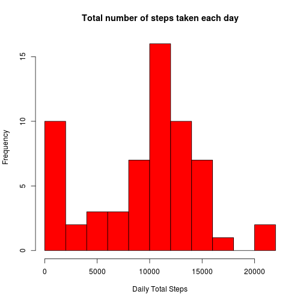

# Reproducible Research: Peer Assessment 1


## Loading and preprocessing the data

The code below will check if the data file exists in the current folder. If not, the script will download the data from internet. Thus, please make sure you are online if you don't have the data in place, or the code might fail downloading the required data.

This part of code is tested under Linux. You might need to modify the *method* parameter for the download.file() function to suit your system.


```r

dataURL <- "https://d396qusza40orc.cloudfront.net/repdata%2Fdata%2Factivity.zip"

### Download data
if (file.exists("./activity.zip") || file.exists("./activity.csv")) {
    message("== Data file (zip or csv format) exists, skipping downloading step \r")
    
} else {
    
    message("== Downloading data file...\r")
    download.file(url = dataURL, destfile = "./activity.zip", method = "wget")
    
}
```

```
## == Data file (zip or csv format) exists, skipping downloading step 
```

```r

### Extract data
if (file.exists("./activity.csv")) {
    message("== Data file (csv format) exists, skipping extraction...\r")
} else {
    message("== Extracting data ... \r")
    unzip(zipfile = "./activity.zip", exdir = "./", )
}
```

```
## == Data file (csv format) exists, skipping extraction...
```

```r


### Load data
data <- read.csv("./activity.csv")

data$date <- as.Date(data$date, format = "%Y-%m-%d")
data$interval <- as.factor(data$interval)
```


## What is mean total number of steps taken per day?


```r

library("plyr")
dfPerDate <- ddply(data, ~date, summarise, sumSteps = sum(steps, na.rm = TRUE), 
    meanSteps = mean(steps, na.rm = TRUE), sdSteps = sd(steps, na.rm = TRUE))

meanTotalStepsPerDay <- mean(dfPerDate$sumSteps, na.rm = TRUE)
medianTotalStepsPerDay <- median(dfPerDate$sumSteps, na.rm = TRUE)

hist(dfPerDate$sumSteps, col = "red", xlab = "", main = "Total steps per day", 
    breaks = 10)
```

 


**Fig. 1:** Histogram of the total number of steps taken each day

The **mean** and **median** of total number of steps taken per day are **9354.2295** and **10395**, respectively.


## What is the average daily activity pattern?


```r
dfPerInterval <- ddply(data, ~interval, summarise, sumSteps = sum(steps, na.rm = TRUE), 
    meanSteps = mean(steps, na.rm = TRUE), sdSteps = sd(steps, na.rm = TRUE))


intervalWithMostSteps <- dfPerInterval$interval[dfPerInterval$meanSteps == max(dfPerInterval$meanSteps)]

with(dfPerInterval, plot(interval, meanSteps, , type = "n", xlab = "Interval", 
    ylab = "Mean steps", main = "Mean steps per 5-min interval"))
with(dfPerInterval, lines(interval, meanSteps))
```

 

**Fig. 2:** 

835

## Imputing missing values


## Are there differences in activity patterns between weekdays and weekends?
